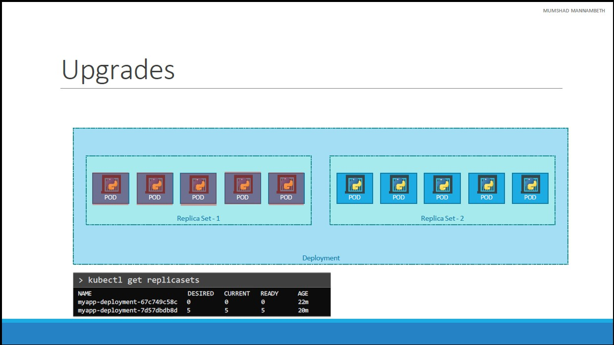

# Kubernetes Personal Notes

## Certifications

- Certified Kuberenetes Administrator Course

```
High Availability Deployment
Kubernetes Scheduler
Logging / Monitoring
Application Lifecycle
Security
Maintenance
Troubleshooting
Core concepts
```

- Certified Kubernetes Application Developper Course

## Beginner Level

What we're learning

```
POD
Services
Networking
Set
Replicas
```

### Containers Overview

Docker is a tool used to set up isolated environments (**containers**) like Prod, Dev, Uat, etc. They can have their own :

- Processes or services
- Networking interfaces
- Mounts

> They are like Virtual machines excepted they all share the same OS Kernel (**responsible for interacting with the underlying hardware**). Unlike them, they consume less memory, disk space and they boot up faster in matter of seconds.
>
> If we have a based Ubuntu OS Kernel, we can not run for example Windows based containers

&nbsp;

Containers already existed long ago into different types :

- LXC
- LXD
- LXCFS
- Etc.

```
 Docker uses LXC containers
```

- An image is like a package or a VM template, used to create Containers
- A container is a running inastance of the image which is isolated and has its own environment and set of processes.

### Kubernetes architecture

Kubernetes is a Container orchestration technology used for :

```
- Scaling up/down the application when the number of users increases/decreases
- High Availability
- Load Balancer
```

#### Basic concepts

- **Node** : a machine , physical or virtual on which Kubernetes is installed and where containers will be launched.

- **Master** : another Node, but used to watch over the nodes in the cluster. Also responsible for orchestration of containers on the worker nodes.

&nbsp;

##### Components :

- **API Server** : it acts as the frontend for Kubernetes. The users, managements devices, CLI talk with it for interacting with Kubernetes clusters.
- **Etcd Keystore** : distributed reliable key value store, used to store all data used to manage the cluster. When we have multiple nodes and masters, Etcd store the information on all the nodes in the distributed manner. It is responsible for implementing locks within the cluster to ensure that there are no conflicts between the masters
- **Scheduler** : responsible for distributing work or containers accross multiple nodes
- **Controller** : responsible for noticing and respin ding when nodes, containers or endpoints go down
- **Kubelet** : agent running on each working node. They are responsible for making sure that containers are running on the nodes as expected

<!--- Center image --->
<div align="center">
  <a href="assets/Kubernetes_Architecture.jpg" target="_blank">
    
  </a>
</div>

&nbsp;

#### Kubectl

- To view information about the cluster

```
🥃 ~ kubectl cluster-info
```

- To list the nodes part of the cluster

```
🥃 ~ kubectl get nodes
```

&nbsp;

## POD

Kubernetes doesn't deploy containers directly on the worker nodes : they are encapsulated into a Kubernetes object (the smallest) called `POD`.

A pod is **a single instance of an application**

<!--- Center image --->
<div align="center">
  <a href="assets/No_New_Instance_Same_Pod.jpg" target="_blank">
    
  </a>
</div>
<div align="center">
  <i>When adding additional instances, you <b>can NOT</b> add a new container instance <b>of the same kind</b> in an existing Pod. We create a new Pod instead.</i>
</div>

&nbsp;

#### Kubectl

- Creating an instance of Ngninx, while downloading the image from Docker Hub

```
🥃 ~ kubectl run nginx --image nginx

pod/nginx created
```

- To list the pods in the cluster

```
🥃 ~ kubectl get pods -o wide

NAME    READY   STATUS              RESTARTS   AGE   IP       NODE             NOMINATED NODE   READINESS GATES
nginx   0/1     ContainerCreating   0          8s    <none>   docker-desktop   <none>           <none>

NAME    READY   STATUS    RESTARTS   AGE   IP          NODE             NOMINATED NODE   READINESS GATES
nginx   1/1     Running   0          37s   10.1.0.23   docker-desktop   <none>           <none>
```

- To get more details about a pod

```
🥃 ~  kubectl describe pod nginx
Name:             nginx
Namespace:        default
Priority:         0
Service Account:  default
Node:             docker-desktop/192.168.65.4
Start Time:       Wed, 15 Feb 2023 19:15:31 +0100
Labels:           run=nginx
Annotations:      <none>
Status:           Running
IP:               10.1.0.23
IPs:
  IP:  10.1.0.23
Containers:
  ...
```

- To stop and delete a pod

```
🥃 ~ kubectl delete pod nginx

pod "nginx" deleted
```

#### YAML

We can create a POD through a `.yml` file.

It must have this template :

```yaml
### pod-definition.yml

# Version of the Kubernetes API, used to create objects
apiVersion: v1
# The type of object we want to create
kind: Pod
# Data about the object
metadata:
  name: mypostgres-pod
  # Kind of identifier to distuinguish a pod among 1000 others
  labels:
    app: mypostgres
    tier: db-tier
# Pod properties (here, only a nginx container)
spec:
  containers:
    - name: postgres-container
      image: postgres
      env:
        - name: POSTGRES_PASSWORD
          value: mysecretpassword
```

&nbsp;

> Then you run `kubectl create -f pod-definition.yml`

```
🥃 ~ kubectl create -f pod-definition.yml
🥃 ~ kubectl apply -f pod-definition.yml

pod/myapp-pod created

🥃 ~ kubectl get pods -o wide

NAME        READY   STATUS    RESTARTS   AGE   IP          NODE             NOMINATED NODE   READINESS GATES
myapp-pod   1/1     Running   0          66s   10.1.0.24   docker-desktop   <none>           <none>

🥃 ~ kubectl describe pod myapp-pod

Name:             myapp-pod
Namespace:        default
Priority:         0
Service Account:  default
Node:             docker-desktop/192.168.65.4
Start Time:       Wed, 15 Feb 2023 19:50:49 +0100
Labels:           app=myapp
                  type=front-end
Annotations:      <none>
Status:           Running
IP:               10.1.0.24
IPs:
  IP:  10.1.0.24
Containers:
  ...
```

&nbsp;

## ~~Replica Controller~~ (Deprecated)

To avoid an user to lose access to the App when the pod crashes, we need to run at the same time another pod instances.

The controller (that monitors Kubernetes objects and respond accordingly), used to create replicas is called `Replica Controller`.

It helps us to run multiple instances of a single Pod in the Kubernetes cluster, thus providing `High Availability`. It is also used for `Load Balancing` & `Scaling`.

The Replication Controller is an older technology being replaced by `Replica Set`

&nbsp;

<!--- Center image --->
<div align="center">
  <a href="assets/Replica_Controller_Ha.jpg" target="_blank">
    
  </a>
</div>
<div align="center">
  <i><b>Even if we plan to have a single Pod</b> we still can use the Replication Controller</i>
</div>

&nbsp;

<!--- Center image --->
<div align="center">
  <a href="assets/Replica_Controller_Load.jpg" target="_blank">
    
  </a>
</div>
<div align="center">
  <i>The Replication Controller spans <b>across multiple nodes</b></i>
</div>

&nbsp;

#### YAML

We can create a Replication Controller through a `.yml` file.

It must have this template :

```yaml
### rc-definition.yml

apiVersion: v1
kind: ReplicationController
# Data about the RC
metadata:
  name: myapp-rc
  labels:
    app: myapp
    type: front-end
spec:
  # Pod template, defined in previous .yml file
  template:
    metadata:
      name: myapp-pod
      labels:
        app: myapp
        type: front-end
    spec:
      containers:
        - name: nginx-container
          image: nginx
  # Minimum instances of Pods
  replicas: 3
```

> Then you run `kubectl create -f rc-definition.yml`

&nbsp;

## Replica Set

The role of the RS is to monitor the pods and if any of them were to fail, it deploys new ones.

Similar to Replication Controller, it has an additional property called `selector`.

`selector` is used as a **filter** to select which pods having the matched label to monitor.

&nbsp;

#### YAML

It must have this template :

```yaml
### replicaset-definition.yml

apiVersion: apps/v1
kind: ReplicaSet
metadata:
  name: myapp-replicaset
  labels:
    app: myapp
    type: front-end
spec:
  # Pod template, defined in previous .yml file
  template:
    metadata:
      name: myapp-pod
      labels:
        app: myapp
        type: front-end
    spec:
      containers:
        - name: nginx-container
          image: nginx
  # Minimum instances of Pods
  replicas: 3
  # Required by the Replica Set. It helps to specify what parts fall under it. Because RS can also manage parts that were not created as part of the RS creation
  selector:
    # Managing Pods having the label 'type: front-end'
    matchLabels:
      type: front-end
```

&nbsp;

> #### Kubectl

- Creating Replica Sets

```
🥃 ~ kubectl create -f replicaset-definition.yml

replicaset.apps/myapp-replicaset created
```

- Updating Replica Sets

```
🥃 ~ kubectl replace -f replicaset-definition.yml
OR
🥃 ~ kubectl edit replicasets new-replica-set

## BUT you have to delete old pods after

replicaset.apps/myapp-replicaset replaced
```

- Listing Replica Sets

```
🥃 ~ kubectl get replicasets -o wide

NAME               DESIRED   CURRENT   READY   AGE   CONTAINERS        IMAGES   SELECTOR
myapp-replicaset   3         3         3       22s   nginx-container   nginx    type=front-end


🥃 ~ kubectl get pods -o wide

NAME                     READY   STATUS    RESTARTS   AGE   IP          NODE             NOMINATED NODE   READINESS GATES
myapp-replicaset-j2v22   1/1     Running   0          77s   10.1.0.43   docker-desktop   <none>           <none>
myapp-replicaset-ssdcq   1/1     Running   0          77s   10.1.0.41   docker-desktop   <none>           <none>
myapp-replicaset-wlq48   1/1     Running   0          77s   10.1.0.42   docker-desktop   <none>           <none>
```

- Scaling Replica Sets

```
🥃 ~ kubectl scale --replicas=6 replicaset myapp-replicaset
OR
🥃 ~ kubectl scale --replicas=6 -f replicaset-definition.yml

replicaset.apps/myapp-replicaset scaled


🥃 ~ kubectl get pods -o wide

NAME                     READY   STATUS    RESTARTS   AGE   IP          NODE             NOMINATED NODE   READINESS GATES
myapp-replicaset-7gdbz   0/1     ContainerCreating   0          4s    <none>      docker-desktop   <none>           <none>
myapp-replicaset-9sc5v   0/1     ContainerCreating   0          4s    <none>      docker-desktop   <none>           <none>
myapp-replicaset-j2v22   1/1     Running             0          13m   10.1.0.43   docker-desktop   <none>           <none>
myapp-replicaset-ssdcq   1/1     Running             0          13m   10.1.0.41   docker-desktop   <none>           <none>
myapp-replicaset-wlq48   1/1     Running             0          13m   10.1.0.42   docker-desktop   <none>           <none>
myapp-replicaset-xmcvs   1/1     Running             0          4s    10.1.0.44   docker-desktop   <none>           <none>
```

&nbsp;

## Deployment

This is a Kubernetes object that comes higher in the hierarchy.

It provides us with the capability to updgrade the underlying instances seamlessly using `rolling updates`, undo changes and pause & resume changes (when modifying hardware for example).

<!--- Center image --->
<div align="center">
  <a href="assets/Deployment_Hierarchy.jpg" target="_blank">
    
  </a>
</div>

&nbsp;

#### YAML

Similar to Replica Set template :

```yaml
### deployment-definition.yml

apiVersion: apps/v1
# The change is here
kind: Deployment
metadata:
  name: myapp-deployment
  labels:
    app: myapp
    type: front-end
spec:
  template:
    metadata:
      name: myapp-pod
      labels:
        app: myapp
        type: front-end
    spec:
      containers:
        - name: nginx-container
          image: nginx
  replicas: 3
  selector:
    matchLabels:
      type: front-end
```

&nbsp;

> #### Kubectl

- Creating deployment

```
🥃 ~ kubectl create -f deployment-definition.yml

deployment.apps/myapp-deployment created
```

- Listing deployment

```
🥃 ~ kubectl get deployments -o wide

NAME               READY   UP-TO-DATE   AVAILABLE   AGE   CONTAINERS        IMAGES   SELECTOR
myapp-deployment   3/3     3            3           31s   nginx-container   nginx    type=front-end

🥃 ~ kubectl get replicaset -o wide

NAME                          DESIRED   CURRENT   READY   AGE   CONTAINERS        IMAGES   SELECTOR
myapp-deployment-7c4d4f7fc6   3         3         1       3s    nginx-container   nginx    pod-template-hash=7c4d4f7fc6,type=front-end

🥃 ~ kubectl get pods -o wide

NAME                                READY   STATUS    RESTARTS   AGE   IP          NODE             NOMINATED NODE   READINESS GATES
myapp-deployment-7c4d4f7fc6-2nn8p   1/1     Running   0          89s   10.1.0.71   docker-desktop   <none>           <none>
myapp-deployment-7c4d4f7fc6-86hwl   1/1     Running   0          89s   10.1.0.73   docker-desktop   <none>           <none>
myapp-deployment-7c4d4f7fc6-r2578   1/1     Running   0          89s   10.1.0.72   docker-desktop   <none>           <none>

🥃 ~ kubectl get all

NAME                                    READY   STATUS    RESTARTS   AGE
pod/myapp-deployment-7c4d4f7fc6-2nn8p   1/1     Running   0          2m54s
pod/myapp-deployment-7c4d4f7fc6-86hwl   1/1     Running   0          2m54s
pod/myapp-deployment-7c4d4f7fc6-r2578   1/1     Running   0          2m54s

NAME                 TYPE        CLUSTER-IP   EXTERNAL-IP   PORT(S)   AGE
service/kubernetes   ClusterIP   10.96.0.1    <none>        443/TCP   4m19s

NAME                               READY   UP-TO-DATE   AVAILABLE   AGE
deployment.apps/myapp-deployment   3/3     3            3           2m54s

NAME                                          DESIRED   CURRENT   READY   AGE
replicaset.apps/myapp-deployment-7c4d4f7fc6   3         3         3       2m54s
```

&nbsp;

## Rolling Update : Update and Rollback

When you first create a deployment, it triggers a `rollout`. A new rollout creates a new deployment `revision`.

This helps us keep track of the changes and enables us to roll back to a previous version of deployment if necessary.

<!--- Center image --->
<div align="center">
  <a href="assets/Rollout_Versioning.jpg" target="_blank">
    
  </a>
</div>

&nbsp;

### Upgrades

When upgrading the application, the Kubernetes deployment object will create a **new Replica Set** under the hood and start deploying containers.

At the same time, in old Replica Set, the containers are shutting down.

<!--- Center image --->
<div align="center">
  <a href="assets/Rollout_Upgrade.jpg" target="_blank">
    
  </a>
</div>

&nbsp;

> #### Kubectl

- Display Rollout status

```
🥃 ~ kubectl rollout status deployment/myapp-deployment

deployment "myapp-deployment" successfully rolled out
```

- Display Rollout history

```
🥃 ~ kubectl create -f deployment-definition.yml
🥃 ~ kubectl rollout history deployment/myapp-deployment

deployment.apps/myapp-deployment
REVISION  CHANGE-CAUSE
1         <none>

🥃 ~ kubectl create -f deployment-definition.yml --record
🥃 ~ kubectl rollout history deployment/myapp-deployment

### using record will create a log in CHANGE-CAUSE

deployment.apps/myapp-deployment
REVISION  CHANGE-CAUSE
1         kubectl.exe create --filename=deployment-definition.yml --record=true
```

- Update deployment

```
🥃 ~ kubectl apply -f deployment-definition.yml
OR
🥃 ~ kubectl set image deployment/myapp-deployment nginx-container=nginx:1.9.1 --record
OR
🥃 ~ kubectl edit deployment deployment/myapp-deployment

### The 2nd command doesn't update the definition file

deployment.apps/myapp-deployment image updated


🥃 ~ kubectl rollout history deployment/myapp-deployment
deployment.apps/myapp-deployment
REVISION  CHANGE-CAUSE
1         kubectl.exe create --filename=deployment-definition.yml --record=true
2         kubectl.exe set image deployment/myapp-deployment nginx-container=nginx:1.9.1 --record=true
```

- Rollback deployment

```
🥃 ~ kubectl rollout undo deployment/myapp-deployment

deployment.apps/myapp-deployment rolled back

🥃 ~ kubectl rollout history deployment/myapp-deployment

deployment.apps/myapp-deployment
REVISION  CHANGE-CAUSE
2         kubectl.exe set image deployment/myapp-deployment nginx-container=nginx:1.9.1 --record=true
3         kubectl.exe create --filename=deployment-definition.yml --record=true
```

&nbsp;

## Networking

- When Kubernetes is initially configured, it has a private network.
- Each Pod are attached to this network.
- To communicate between nodes, we have to use a 3rd party solution

<!--- Center image --->
<div align="center">
  <a href="assets/Networking_Base_1.jpg" target="_blank">
    
  </a>
</div>
<div align="center">
  <i>Kubernetes does <b>NOT</b> provide tools to communicate between nodes. It expects <b>US</b> to setup a networking solution that meets the following criteria</i>
</div>

&nbsp;

<!--- Center image --->
<div align="center">
  <a href="assets/Networking_Base_2.jpg" target="_blank">
    
  </a>
  <a href="assets/Networking_Base_3.jpg" target="_blank">
    
  </a>
</div>
<div align="center">
  <i>You need to use a <b>3rd party</b> solution. If you deploy Kubernetes into a Vm Ware environment, use NSX</i>
</div>

&nbsp;

## Services

Kubernetes services enable communication between various components within and outside of the application.

It helps us to connect applications together with other applications or users. Thus they enable loose coupling between micro services in our application.

<!--- Center image --->
<div align="center">
  <a href="assets/Services_Intro_1.jpg" target="_blank">
    
  </a>
</div>
<div align="center">
  <i>Services enable connectivity between groups of PODs. There is 1 for interacting between users and the front-end PODs, 1 for communication between back-end and front-end PODs, and 1 establishing connectivity to an external data source</i>
</div>

&nbsp;

There are different types of services.

<!--- Center image --->
<div align="center">
  <a href="assets/Services_Types.jpg" target="_blank">
    
  </a>
</div>

&nbsp;

### NodePort

> They listens to a port on the Node and forwards requests to PODs.

- The port on the POD were the actual web server is running is port 80. And it is referred to as the `targetPort`, because that is were the service forwards the requests to.

- The second port is the port on the service itself. It is simply referred to as the `port`.

- And finally we have the port on the Node itself which we use to access the web server externally. And that is known as the `NodePort`. They can only be in a valid range which is from `30000 to 32767`.

The service is in fact like a virtual server inside the node. Inside the cluster it has its own IP address. And that IP address is called the `Cluster-IP` of the service.

<!--- Center image --->
<div align="center">
  <a href="assets/Services_NodePort_1.jpg" target="_blank">
    
  </a>
</div>

&nbsp;

#### YAML

The template :

```yaml
### service-definition.yml

apiVersion: v1
kind: Service
metadata:
  name: myapp-service
# The most crucial part
spec:
  type: NodePort
  ports:
    - targetPort: 80
      port: 80
      nodePort: 30008
  # For targeting specific PODs
  selector:
    app: myapp
    type: front-end
```

&nbsp;

> #### Kubectl

- Creating service

```
🥃 ~ kubectl create -f service-definition.yml

service/myapp-service created
```

- Displaying services

```
🥃 ~ kubectl get services

NAME            TYPE        CLUSTER-IP     EXTERNAL-IP   PORT(S)        AGE
kubernetes      ClusterIP   10.96.0.1      <none>        443/TCP        4h9m
myapp-service   NodePort    10.106.30.14   <none>        80:30008/TCP   13s

### With Docker-Desktop, you just have to test the URL connection : http://localhost:30008/
### With minikube, you need this command line : minikube service myapp-service --url
```

&nbsp;

> NodePort services act as a built-in load balancer to distribute load across multiple PODs instances. We don't need to do extra configurations

<!--- Center image --->
<div align="center">
  <a href="assets/Services_NodePort_2.jpg" target="_blank">
    
  </a>
</div>

&nbsp;

> When we have multiple nodes, Kubernetes creates a service that spans across all the nodes in the cluster and maps the target port `to the SAME NodePort on ALL the nodes in the cluster`.
>
> This way you can access your application using the IP of any node in the cluster and using the same port number which in this case is 30008.

<!--- Center image --->
<div align="center">
  <a href="assets/Services_NodePort_3.jpg" target="_blank">
    
  </a>
</div>

&nbsp;

### ClusterIP

> This service help us group the pods together and provide a single interface to access the pods in a group.
>
> It gets an IP and name assigned to it inside the cluster and that is the name that should be used by other PODs to access it.

<!--- Center image --->
<div align="center">
  <a href="assets/Services_ClusterIp_1.jpg" target="_blank">
    
  </a>
</div>

&nbsp;

#### YAML

The template :

```yaml
### service-definition.yml

apiVersion: v1
kind: Service
metadata:
  name: back-end
spec:
  # The change is here
  type: ClusterIP
  ports:
    - targetPort: 80
      port: 80
  # For targeting specific PODs
  selector:
    app: myapp
    type: back-end
```

&nbsp;

### LoadBalancer

- The ClusterIP service makes a service, such as a redis or database service available internally within the kubernetes cluster for other applications to consume.

- To expose the application to the end users, we create another service of type NodePort.

**Now, what IP to give to end users for accessing the application ?** We cannot give them all three and let them choose one of their own : they want a single URL.

&nbsp;

2 solutions :

> Setup a separate Load Balancer VM in your environment and configure it to forward requests with a Reverse Proxy.
>
> Then configure the organizations DNS to point to this load balancer when a user hosts http://myapp.com.

> On a supported CloudPlatform, like Google Cloud Platform, we just configure a file for Kubetrnetes.

<!--- Center image --->
<div align="center">
  <a href="assets/Services_LoadBalancer_1.jpg" target="_blank">
    
  </a>
</div>

&nbsp;

#### YAML

The template :

```yaml
### service-definition.yml

apiVersion: v1
kind: Service
metadata:
  name: myapp-service
spec:
  # The change is here
  type: LoadBalancer
  ports:
    - targetPort: 80
      port: 80
      nodePort: 30008
```

&nbsp;

## Microservices on Kubernetes

<!--- Center image --->
<div align="center">
  <a href="assets/Deployment_MicroServices_1.jpg" target="_blank">
    
  </a>

  <div align="center">
    <i>Deploying Pod manually on Kubernetes can be challenging</i>
  </div>
</div>

&nbsp;

<!--- Center image --->
<div align="center">
  <a href="assets/Deployment_MicroServices_2.jpg" target="_blank">
    
  </a>

  <div align="center">
    <i>Having PODs into a Deployment object can help us to scale up / down our application</i>
  </div>
</div>

&nbsp;

## Kubeadm

We will install a Kubernetes environment, using `Kubeadm`. Here are the following steps :

- Having multiple VMs created for configuring a cluster. Once the systems are created, designate one as master and others as worker nodes.

- Installing a container runtime on the hosts.

- Installing `kubeadmin` tool on all the nodes. The kubeadmin tool helps us bootstrap the kubernetes solution by installing and configuring all the required components in the right nodes.

- Initializing the Master server. During this process all the required components are installed and configured on the master server. That way we can start the cluster level configurations from the master server.

- Ensuring that the network pre-requisites are met. A normal network connectivity between the systems is not SUFFICIENT for this. Kubernetes requires a special network between the master and worker nodes which is called as a `POD network`

- The last step is to join the worker nodes to the master node. We are then all set to launch our application in the kubernetes environment.

<!--- Center image --->
<div align="center">
  <a href="assets/Kubernetes_Kubeadm_1.jpg" target="_blank">
    
  </a>
</div>

&nbsp;

### Steps for preparing the environment

- Install `Vagrant`
- `git clone git@github.com:kodekloudhub/certified-kubernetes-administrator-course.git`
- Edit `Vagrantfile` for checking settings

```yaml
# Define the number of master and worker nodes
# If this number is changed, remember to update setup-hosts.sh script with the new hosts IP details in /etc/hosts of each VM.
NUM_MASTER_NODE = 1
NUM_WORKER_NODE = 2

## VM will get an IP address in this range. Be sure to NOT match your private network
IP_NW = "192.168.56."
MASTER_IP_START = 1
NODE_IP_START = 2
```

- Run the command to check your cluster status `vagrant status`

```
Current machine states:

kubemaster                not created (virtualbox)
kubenode01                not created (virtualbox)
kubenode02                not created (virtualbox)

This environment represents multiple VMs. The VMs are all listed
above with their current state. For more information about a specific
VM, run `vagrant status NAME`.
```

- Provision the VMs : `vagrant up`

```
Bringing machine 'kubemaster' up with 'virtualbox' provider...
Bringing machine 'kubenode01' up with 'virtualbox' provider...
Bringing machine 'kubenode02' up with 'virtualbox' provider...

...
```

Be sure it doesn't match your private network

```
The specified host network collides with a non-hostonly network!
This will cause your specified IP to be inaccessible. Please change
the IP or name of your host only network so that it no longer matches that of
a bridged or non-hostonly network.

Bridged Network Address: '192.168.178.0'
Host-only Network 'Realtek RTL8852AE WiFi 6 802.11ax PCIe Adapter': '192.168.178.0'
```

- Check if they are running : `vagrant status`

```
Current machine states:

kubemaster                running (virtualbox)
kubenode01                running (virtualbox)
kubenode02                running (virtualbox)
```

- To access one of the systems (for example `kubemaster`) : `vagrant ssh kubemaster`

```
Welcome to Ubuntu 18.04.6 LTS (GNU/Linux 4.15.0-204-generic x86_64)

 * Documentation:  https://help.ubuntu.com
 * Management:     https://landscape.canonical.com
 * Support:        https://ubuntu.com/advantage

  System information as of Fri Feb 17 19:12:46 UTC 2023

  ...
```

&nbsp;

### Provisionning cluster using Kubeadm (Docker install)

&nbsp;

> First install pre-requisites on every nodes (`kubemaster`, `kubenode01`, `kubenode02`) :

> `https://kubernetes.io/docs/setup/production-environment/tools/kubeadm/install-kubeadm/`

> `https://bikramat.medium.com/set-up-a-kubernetes-cluster-with-kubeadm-508db74028ce`

> `https://lachlandeer.github.io/installation-guide/docker/`

- Bridge Traffic on all nodes

```bash
vagrant@kubemaster:~$ lsmod | grep br_netfilter
vagrant@kubemaster:~$ sudo modprobe br_netfilter
vagrant@kubemaster:~$ lsmod | grep br_netfilter
br_netfilter           24576  0
bridge                155648  1 br_netfilter

vagrant@kubemaster:~$ cat <<EOF | sudo tee /etc/sysctl.d/k8s.conf
 net.bridge.bridge-nf-call-ip6tables = 1
 net.bridge.bridge-nf-call-iptables = 1
EOF

vagrant@kubemaster:~$ sudo sysctl --system
```

- Install Docker on all nodes

```bash
# Install packages to allow apt to use a repository over HTTPS
vagrant@kubemaster:~$ sudo apt-get update && sudo apt-get install -y apt-transport-https ca-certificates curl software-properties-common gnupg2

# Add Docker's official GPG key
vagrant@kubemaster:~$ sudo -i
root@kubemaster:~$ sudo curl -fsSL https://download.docker.com/linux/ubuntu/gpg | apt-key add -

# Add Docker apt repository
root@kubemaster:~$ sudo add-apt-repository \
   "deb [arch=amd64] https://download.docker.com/linux/ubuntu \
   $(lsb_release -cs) \
   stable"

# Install Docker CE
root@kubemaster:~$ sudo apt-get install docker-ce docker-ce-cli containerd.io

# Setup Docker daemon
root@kubemaster:~$ cat <<EOF | sudo tee /etc/docker/daemon.json
{
  "exec-opts": ["native.cgroupdriver=systemd"],
  "log-driver": "json-file",
  "log-opts": {
    "max-size": "100m"
  },
  "storage-driver": "overlay2"
}
EOF

root@kubemaster:~$ mkdir -p /etc/systemd/system/docker.service.d

# Restart Docker
root@kubemaster:~$ systemctl daemon-reload
root@kubemaster:~$ systemctl restart docker
root@kubemaster:~$ systemctl status docker
```

- Install Kube packages on all nodes

```bash
root@kubemaster:~$ sudo apt-get update && sudo apt-get install -y apt-transport-https curl
root@kubemaster:~$ sudo curl -s https://packages.cloud.google.com/apt/doc/apt-key.gpg | sudo apt-key add -
root@kubemaster:~$ sudo cat <<EOF | sudo tee /etc/apt/sources.list.d/kubernetes.list
deb https://apt.kubernetes.io/ kubernetes-xenial main
EOF
root@kubemaster:~$ sudo apt-get update
root@kubemaster:~$ sudo apt-get install -y kubelet kubeadm kubectl
root@kubemaster:~$ sudo apt-mark hold kubelet kubeadm kubectl
```

- ~~Configuring cgroup driver~~ (Not necessary when using Docke~r, Kubaadm will detect it automatically)
- ~~Initializing a control plane node~~ (only applicable if we're deployin an High Available cluster)
- Configuring POD Network (we will use a CIDR network different from nodes)

> We must specify the Kubernetes API server's IP address as the `API server advertise address`, to listen on the static IP address we have on the master node which will make it accessible to the worker nodes or any other clients.

```bash
~$ vagrant ssh kubemaster

# Check master IP address
root@kubemaster:~$ ifconfig

enp0s8: flags=4163<UP,BROADCAST,RUNNING,MULTICAST>  mtu 1500
        inet 192.168.56.2  netmask 255.255.255.0  broadcast 192.168.56.255


# In case you have [ERROR CRI]: container runtime is not running (https://k21academy.com/docker-kubernetes/container-runtime-is-not-running/)
root@kubemaster:~$  rm /etc/containerd/config.toml
root@kubemaster:~$  systemctl restart containerd

# It proceeds withe the creation of security certificates and various components. Also save output to a file in case you clear the console without having copied the token
root@kubemaster:~$ kubeadm init --pod-network-cidr 10.244.0.0/16 --apiserver-advertise-address=192.168.56.2 >> KubeAdmInit.txt

# You can also wave it into terminal history
echo "kubeadm join 192.168.56.2:6443 --token 7tcnxp.ngjwi6rz8g0dg8r1 \
        --discovery-token-ca-cert-hash sha256:f66227abbc1b9d78177c5045ea0267ed54f6c860f9f62f9c0549c29e917b3627"

# To start the cluster, you need to run the following as a regular user
# admin.conf file has the necessary information and credentails required to access the Kubernetes
root@kubemaster:~$ logout
vagrant@kubemaster:~$ mkdir -p $HOME/.kube
vagrant@kubemaster:~$ sudo cp -i /etc/kubernetes/admin.conf $HOME/.kube/config
vagrant@kubemaster:~$ sudo chown $(id -u):$(id -g) $HOME/.kube/config


# By checking the node, you will see it is not ready because we do not have a pod network solution
vagrant@kubemaster:~$ kubectl get nodes

NAME         STATUS     ROLES           AGE     VERSION
kubemaster   NotReady   control-plane   4m58s   v1.26.1

# Install POD network
vagrant@kubemaster:~$ kubectl apply -f "https://cloud.weave.works/k8s/net?k8s-version=$(kubectl version | base64 | tr -d '\n')"
```

> Then you can join any number of worker nodes by running the following on each as root:

```bash
vagrant@kubemaster:~$ kubeadm join 192.168.56.2:6443 --token 7tcnxp.ngjwi6rz8g0dg8r1 \
        --discovery-token-ca-cert-hash sha256:f66227abbc1b9d78177c5045ea0267ed54f6c860f9f62f9c0549c29e917b3627
```

&nbsp;

### Provisionning cluster using Kubeadm (Using kubeadm to Create a Cluster)
